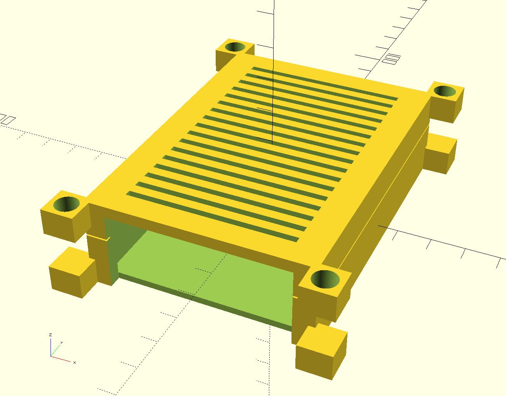

# openscad-raspberrypi-case
customizable cases for raspberry pi



build with build-all.sh

```bash
$> ./build-all.sh
rpi-case-bottom-cluster-1
rpi-case-bottom-cluster-2
rpi-case-bottom-cluster-3
rpi-case-bottom-cluster-4
rpi-case-bottom-no-cluster-1
rpi-case-bottom-no-cluster-2
rpi-case-bottom-no-cluster-3
rpi-case-bottom-no-cluster-4
rpi-case-top-cluster-with-aeration
rpi-case-top-cluster-without-aeration
rpi-case-top-no-cluster-with-aeration
rpi-case-top-no-cluster-without-aeration
```

